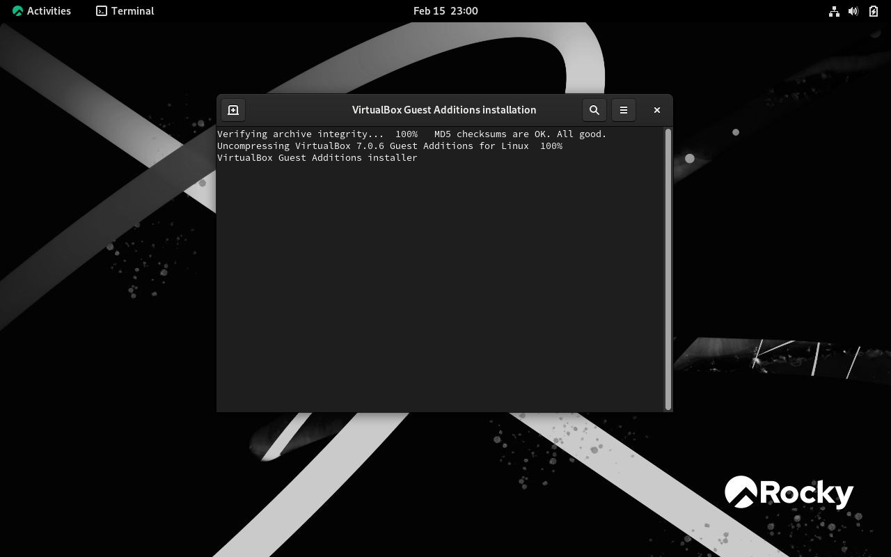

---
## Front matter
lang: ru-RU
title:  "Лабораторная работа №1"
subtitle:  "Установка и конфигурация операционной системы на виртуальную машину"
author:
  - Чемоданова А.А.
  
## Formatting pdf
toc: false
toc-title: Содержание
slide_level: 2
aspectratio: 169
section-titles: true
theme: metropolis
header-includes:
 - \metroset{progressbar=frametitle,sectionpage=progressbar,numbering=fraction}
 - '\makeatletter'
 - '\beamer@ignorenonframefalse'
 - '\makeatother'
---

## Цель работы

Целью данной работы является приобретение практических навыков установки операционной системы на виртуальную машину, настройки минимально необходимых для дальнейшей работы сервисов.

## Задание

Установить и настроить операционную систему на виртуальную машину.

## Выполнение работы

Запускаем VirtualBox и создаем новую виртуальную машину. Указываем имя виртуальной машины (логин в дисплейном классе), тип операционной системы — Linux, Rocky. 

{#fig:001 width=50%}

## Выполнение работы

Указываем размер основной памяти виртуальной машины — от 2048 МБ. 

{#fig:002 width=70%}

## Выполнение работы

Затем выбираем "Создать новый виртуальный жесткий диск". Задаем размер диска — 20 ГБ (или больше). 

{#fig:003 width=70%}

## Выполнение работы

Подытоживаем конфигурацию виртуальной машины и нажимаем "Готово".

{#fig:004 width=70%}

## Выполнение работы

Теперь мы можем запустить нашу настроенную виртуальную машину. 

{#fig:005 width=40%}

## Выполнение работы

Подключение образа оптического диска. 

{#fig:006 width=50%}

## Выполнение работы

Запускаем виртуальную машину. Выбираем язык. 

{#fig:007 width=50%}

## Выполнение работы

Окно настройки установки.

{#fig:008 width=50%}

## Выполнение работы

Окно настройки установки: выбор программ. 

{#fig:009 width=50%}

## Выполнение работы

Отключение KDUMP. 

{#fig:010 width=50%}

## Выполнение работы

Место установки. 

{#fig:011 width=50%}

## Выполнение работы

Сеть и имя узла. 

{#fig:012 width=50%}

## Выполнение работы

Установка пароля для root.

{#fig:013 width=50%}

## Выполнение работы

Установка пароля для пользователя с правами администратора.

{#fig:014 width=50%}

## Выполнение работы

Завершение установки ОС. 

{#fig:015 width=50%}

## Выполнение работы

Экран Rocky. 

{#fig:016 width=50%}

## Выполнение работы

Подключение образа диска дополнительной гостевой ОС. 

{#fig:017 width=50%}

## Выполнение работы

Домашнее задание. 

{#fig:018 width=50%}

## Выводы

В результате выполнения работы мы приобрели практические навыки установки операционной системы на виртуальную машину, а также настройки минимально необходимых для дальнейшей работы сервисов.
