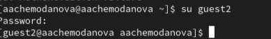

---
## Front matter
lang: ru-RU
title: "Лабораторная работа №3"
subtitle: "Дискреционное разграничение прав в Linux. Два пользователя"
author:
  - Чемоданова А.А.

## Formatting pdf
toc: false
toc-title: Содержание
slide_level: 2
aspectratio: 169
section-titles: true
theme: metropolis
header-includes:
 - \metroset{progressbar=frametitle,sectionpage=progressbar,numbering=fraction}
 - '\makeatletter'
 - '\beamer@ignorenonframefalse'
 - '\makeatother'
---

## Цель работы

Получение практических навыков работы в консоли с атрибутами файлов для пользователей.

## Выполнение работы

1. Создаем учетную запись пользователя guest(использую учетную запись администратора) при помощи команды useradd guest. Задаем пароль для пользователя guest(испоьзуя учетную запись администратора) при помощи команды passwd guest. У меня уже была создана данная учетная запись. 

{#fig:001 width=70%}

## Выполнение работы

2. Создаем учетную запись пользователя guest2(использую учетную запись администратора) при помощи команды useradd guest2. Задаем пароль для пользователя guest2(испоьзуя учетную запись администратора) при помощи команды passwd guest2. 

{#fig:002 width=70%}

## Выполнение работы

3. Добавляю пользователя guest2 в группу guest. 

{#fig:003 width=70%}

## Выполнение работы

4. Осуществляю вход в систему от двух пользователей на двух разных консолях guest, на второй guest2.

{#fig:004 width=70%}

{#fig:005 width=70%}

## Выполнение работы

5. Определяю директорию, в которой нахожусь для обоих консолей. 

{#fig:006 width=70%}

{#fig:007 width=70%}

## Выполнение работы

6. Уточняю имя пользователя командой whoami. Уточняю имя пользователя, его группу, а также группы, куда входит пользователь, командой id. Определяю командами groups guest, groups guest2, в какие группы входят пользователи guest, guest2. 

{#fig:008 width=35%}

{#fig:009 width=35%}

## Выполнение работы

7. Сравниваю полученную информацию с содержимым файла /etc/group командой cat /etc/group.

{#fig:010 width=70%}

{#fig:011 width=70%}

## Выполнение работы

8. От имени пользователя guest2 выполняю регистрацию пользователя guest2 в группе guest командой newgrp guest. 

{#fig:012 width=70%}

## Выполнение работы

9. От имени пользователя guest изменяю права директории /home/guest, разрешив все действия для пользователей группы, командой chmod g+rwx /home/guest 

{#fig:013 width=70%}

## Выполнение работы

10. От имени пользователя guest снимаю с директории /home/guest/dirl все атрибуты командой chmod 000 dirl.

{#fig:014 width=70%}

## Выполнение работы

11. Проверка прав для таблицы.

{#fig:015 width=70%}

## Заполнение таблицы 3.1

11. Меняя атрибуты у директории dir1 и файла file1 от имени пользователя guest и делая проверку от пользователя guest2, заполним табл. 3.1, определив опытным путём, какие операции разрешены, а какие нет. 

|   Права директории   |      Права файла     | Создание файла| Удаление файла | Запись в файл | Чтение файла | Смена директории | Просмотр файлов в директории | Переименование файл | Смена атрибутов файла |
|:---------------------|:---------------------|-----|-----|-----|-----|-----|-----|-----|-----|
|```d--------- (000)```|```---------- (000)```|  -	|  -  |  -  |  -  |  -	|  -  |  -  |  -  |
|```d-----x--- (010)```|```---------- (000)```|  -	|  -  |	 -	|  -  |  +  |  -  |  -  |  +  |
|```d----w---- (020)```|```---------- (000)```|  -	|  -  |	 -  |  -  |  -	|  -  |  -  |  -  |
|```d----wx--- (030)```|```---------- (000)```|  +	|  +  |  -	|  -  |  +  |  -  |  +  |  +  |
|```d---r----- (040)```|```---------- (000)```|  -	|  -  |	 -  |  -  |  -	|  +  |  -  |  -  |
|```d---r-x--- (050)```|```---------- (000)```|  -	|  -  |  -	|  -  |  +  |  +  |  -  |  +  |
|```d---rw---- (060)```|```---------- (000)```|  -	|  -  |  -  |  -  |  -	|  +  |  -  |  -  |
|```d---rwx--- (070)```|```---------- (000)```|  +	|  +  |	 -	|  -  |  +	|  +  |  +  |  +  |
|```d--------- (000)```|```------x--- (010)```|  -	|  -  |  -  |  -  |  -	|  -  |  -  |  -  |
|```d-----x--- (010)```|```------x--- (010)```|  -  |  -  |	 -	|  -  |  +	|  -  |  -  |  +  |
|```d----w---- (020)```|```------x--- (010)```|  -	|  -  |  -  |  -  |  -	|  -  |  -  |  -  |
|```d----wx--- (030)```|```------x--- (010)```|  +	|  +  |	 -	|  -  |  +	|  -  |  +  |  +  |
|```d---r----- (040)```|```------x--- (010)```|  -	|  -  |  -  |  -  |  -	|  +  |  -  |  -  |
|```d---r-x--- (050)```|```------x--- (010)```|  -	|  -  |	 -	|  -  |  +	|  +  |  -  |  +  |
|```d---rw---- (060)```|```------x--- (010)```|  -	|  -  |  -  |  -  |  -	|  +  |  -  |  -  |
|```d---rwx--- (070)```|```------x--- (010)```|  +	|  +  |	 -	|  -  |  +	|  +  |  +  |  +  |
|```d--------- (000)```|```-----w---- (020)```|  -	|  -  |  -  |  -  |  -	|  -  |  -  |  -  |
|```d-----x--- (010)```|```-----w---- (020)```|  -	|  -  |	 +	|  -  |  +	|  -  |  -  |  +  |
|```d----w---- (020)```|```-----w---- (020)```|  -	|  -  |  -  |  -  |  -	|  -  |  -  |  -  |
|```d----wx--- (030)```|```-----w---- (020)```|  +	|  +  |	 +	|  -  |  +	|  -  |  +  |  +  |
|```d---r----- (040)```|```-----w---- (020)```|  -	|  -  |  -  |  -  |  -	|  +  |  -  |  -  |
|```d---r-x--- (050)```|```-----w---- (020)```|  -	|  -  |	 +  |  -  |  +	|  +  |  -  |  +  |
|```d---rw---- (060)```|```-----w---- (020)```|  -	|  -  |  -  |  -  |  -	|  +  |  -  |  -  |
|```d---rwx--- (070)```|```-----w---- (020)```|  +	|  +  |	 +	|  -  |  +	|  +  |  +  |  +  |
|```d--------- (000)```|```-----wx--- (030)```|  -	|  -  |  -  |  -  |  -	|  -  |  -  |  -  |
|```d-----x--- (010)```|```-----wx--- (030)```|  -	|  -  |	 +	|  -  |  +	|  -  |  -  |  +  |
|```d----w---- (020)```|```-----wx--- (030)```|  -	|  -  |  -  |  -  |  -	|  -  |  -  |  -  |
|```d----wx--- (030)```|```-----wx--- (030)```|  +  |  +  |	 +  |  -  |  +  |  -  |  +  |  +  |
|```d---r----- (040)```|```-----wx--- (030)```|  -	|  -  |  -  |  -  |  -	|  +  |  -  |  -  |
|```d---r-x--- (050)```|```-----wx--- (030)```|  -  |  -  |	 +	|  -  |  +	|  +  |  -  |  +  |
|```d---rw---- (060)```|```-----wx--- (030)```|  -	|  -  |  -  |  -  |  -	|  +  |  -  |  -  |
|```d---rwx--- (070)```|```-----wx--- (030)```|  +	|  +  |	 +	|  -  |  +	|  +  |  +  |  +  |
|```d--------- (000)```|```----r----- (040)```|  -	|  -  |  -  |  -  |  -	|  -  |  -  |  -  |
|```d-----x--- (010)```|```----r----- (040)```|  -	|  -  |	 -	|  +  |  +	|  -  |  -  |  +  |
|```d----w---- (020)```|```----r----- (040)```|  -	|  -  |  -  |  -  |  -	|  -  |  -  |  -  |
|```d----wx--- (030)```|```----r----- (040)```|  +	|  +  |	 -	|  +  |  +	|  -  |  +  |  +  |
|```d---r----- (040)```|```----r----- (040)```|  -	|  -  |  -  |  -  |  -	|  +  |  -  |  -  |
|```d---r-x--- (050)```|```----r----- (040)```|  -  |  -  |	 -	|  +  |  +  |  +  |  -  |  +  |
|```d---rw---- (060)```|```----r----- (040)```|  -	|  -  |  -  |  -  |  -	|  +  |  -  |  -  |
|```d---rwx--- (070)```|```----r----- (040)```|  +	|  +  |	 -	|  +  |  +	|  +  |  +  |  +  |
|```d--------- (000)```|```----r-x--- (050)```|  -	|  -  |  -  |  -  |  -	|  -  |  -  |  -  |
|```d-----x--- (010)```|```----r-x--- (050)```|  -	|  -  |	 -	|  +  |  +	|  -  |  -  |  +  |
|```d----w---- (020)```|```----r-x--- (050)```|  -	|  -  |  -  |  -  |  -	|  -  |  -  |  -  |
|```d----wx--- (030)```|```----r-x--- (050)```|  +	|  +  |	 -  |  +  |  +	|  -  |  +  |  +  |
|```d---r----- (040)```|```----r-x--- (050)```|  -	|  -  |  -  |  -  |  -	|  +  |  -  |  -  |
|```d---r-x--- (050)```|```----r-x--- (050)```|  -	|  -  |	 -	|  +  |  +	|  +  |  -  |  +  |
|```d---rw---- (060)```|```----r-x--- (050)```|  -	|  -  |  -  |  -  |  -	|  +  |  -  |  -  |
|```d---rwx--- (070)```|```----r-x--- (050)```|  +	|  +  |	 -	|  +  |  +	|  +  |  +  |  +  |
|```d--------- (000)```|```----rw---- (060)```|  -	|  -  |  -  |  -  |  -	|  -  |  -  |  -  |
|```d-----x--- (010)```|```----rw---- (060)```|  -	|  -  |  +	|  +  |  +	|  -  |  -  |  +  |
|```d----w---- (020)```|```----rw---- (060)```|  -	|  -  |  -  |  -  |  -	|  -  |  -  |  -  |
|```d----wx--- (030)```|```----rw---- (060)```|  +	|  +  |	 +	|  +  |  +	|  -  |  +  |  +  |
|```d---r----- (040)```|```----rw---- (060)```|  -	|  -  |  -  |  -  |  -	|  +  |  -  |  -  |
|```d---r-x--- (050)```|```----rw---- (060)```|  -  |  -  |	 +	|  +  |  +	|  +  |  -  |  +  |
|```d---rw---- (060)```|```----rw---- (060)```|  -	|  -  |  -  |  -  |  -	|  +  |  -  |  -  |
|```d---rwx--- (070)```|```----rw---- (060)```|  +  |  +  |	 +	|  +  |  +	|  +  |  +  |  +  |
|```d--------- (000)```|```----rwx--- (070)```|  -	|  -  |  -  |  -  |  -	|  -  |  -  |  -  |
|```d-----x--- (010)```|```----rwx--- (070)```|  -  |  -  |	 +	|  +  |  +	|  -  |  -  |  +  |
|```d----w---- (020)```|```----rwx--- (070)```|  -	|  -  |  -  |  -  |  -	|  -  |  -  |  -  |
|```d----wx--- (030)```|```----rwx--- (070)```|  +  |  +  |	 +	|  +  |  +	|  -  |  +  |  +  |
|```d---r----- (040)```|```----rwx--- (070)```|  -	|  -  |  -  |  -  |  -	|  +  |  -  |  -  |
|```d---r-x--- (050)```|```----rwx--- (070)```|  -  |  -  |	 +	|  +  |  +	|  +  |  -  |  +  |
|```d---rw---- (060)```|```----rwx--- (070)```|  -	|  -  |  -  |  -  |  -	|  +  |  -  |  -  |
|```d---rwx--- (070)```|```----rwx--- (070)```|  +  |  +  |	 +	|  +  |  +	|  +  |  +  |  +  |

Таблица 3.1 «Установленные права и разрешённые действия для групп»

## Заполнение таблицы 3.2

12. На основании заполненной таблицы определим те или иные минимально необходимые права для выполнения пользователем guest2 операций внутри директории dir1 и заполним табл. 3.2

|        Операция        | Права на директорию | Права на файл |
|------------------------|---------------------------------|---------------------------|
|     Создание файла     |           ```d----wx--- (030)```      |      ```---------- (000)```     |	    
|     Удаление файла     |           ```d----wx--- (030)```      |      ```---------- (000)```     |
|      Чтение файла      |           ```d-----x--- (010)```      |      ```----r----- (040)```     |
|      Запись в файл     |           ```d-----x--- (010)```      |      ```-----w---- (020)```     |
|  Переименование файла  |           ```d----wx--- (030)```      |      ```---------- (000)```     |
| Создание поддиректории |           ```d----wx--- (030)```      |      ```---------- (000)```     |
| Удаление поддиректории |           ```d----wx--- (030)```      |      ```---------- (000)```     |

Таблица 3.2 «Минимальные права для совершения операций от имени пользователей входящих в группу»

Сравнивая таблицу 3.1. с таблицей 2.1, можно сказать, что они одинаковы. Единственное различие в том, что в прошлый раз мы присваивали права владельцу, а в этот раз группе.

## Выводы

Мы получили практические навыки работы в консоли с атрибутами файлов для пользователей.
