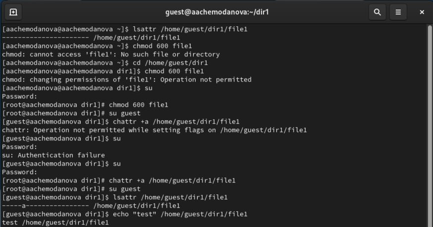
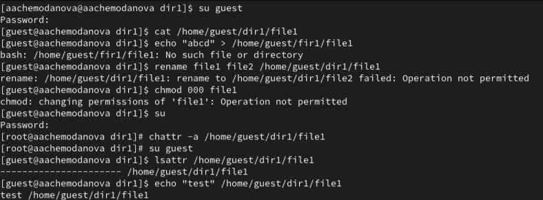
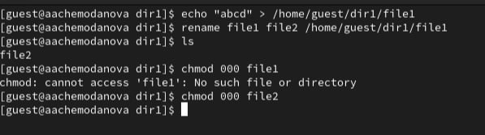
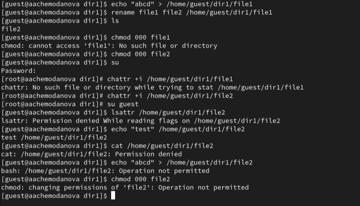

---
## Front matter
lang: ru-RU
title: "Лабораторная работа №4"
subtitle: "Дискреционное разграничение прав в Linux. Расширенные атрибуты"
author:
  - Чемоданова А.А.

## Formatting pdf
toc: false
toc-title: Содержание
slide_level: 2
aspectratio: 169
section-titles: true
theme: metropolis
header-includes:
 - \metroset{progressbar=frametitle,sectionpage=progressbar,numbering=fraction}
 - '\makeatletter'
 - '\beamer@ignorenonframefalse'
 - '\makeatother'
---

## Цель работы

Получение практических навыков работы в консоли с расширенными атрибутами файлов. 

## Выполнение работы

1. От имени пользователя guest определите расширенные атрибуты файла /home/guest/dir1/file1 командой lsattr /home/guest/dir1/file1. 
2. Установите командой chmod 600 file1 на файл file1 права, разрешающие чтение и запись для владельца файла. 
3. Попробуйте установить на файл /home/guest/dir1/file1 расширенный атрибут a от имени пользователя guest: chattr +a /home/guest/dir1/file1. В ответ мы получили отказ от выполнения операции. 
4. Зайдите на третью консоль с правами администратора либо повысьте свои права с помощью команды su. Попробуйте установить расширенный атрибут a на файл /home/guest/dir1/file1 от имени суперпользователя: chattr +a /home/guest/dir1/file1. 

## Выполнение работы

5. От пользователя guest проверьте правильность установления атрибута: lsattr /home/guest/dir1/file1.
6. Выполните дозапись в файл file1 слова «test» командой echo "test" /home/guest/dir1/file1
После этого выполните чтение файла file1 командой cat /home/guest/dir1/file1 Убедимся, что слово test было успешно записано в file1. 

{#fig:001 width=45%}

## Выполнение работы

7. Попробуйте удалить файл file1 либо стереть имеющуюся в нём информацию командой echo "abcd" > /home/guest/dirl/file1. Попробуем переименовать файл.
8. Попробуйте с помощью команды chmod 000 file1 установить на файл file1 права, например, запрещающие чтение и запись для владельца файла. Выполнить команды не удалось. 
9. Снимите расширенный атрибут a с файла /home/guest/dirl/file1 от имени суперпользователя командой chattr -a /home/guest/dir1/file1. Теперь все операции выполняются. 

{#fig:002 width=45%}

## Выполнение работы

{#fig:003 width=70%}

## Выполнение работы

10. Повторите ваши действия по шагам, заменив атрибут «a» атрибутом «i». Дозаписать информацию не удалось. В целом, все действия были ограничены. 

{#fig:004 width=50%}

## Выводы

В результате выполнения работы мы повысили свои навыки использования интерфейса командой строки (CLI), познакомились на примерах с тем, как используются основные и расширенные атрибуты при разграничении доступа. Имели возможность связать теорию дискреционного разделения доступа (дискреционная политика безопасности) с её реализацией на практике в ОС Linux. Составили наглядные таблицы, поясняющие какие операции возможны при тех или иных установленных правах. Опробовали действие на практике расширенных атрибутов «а» и «i».
