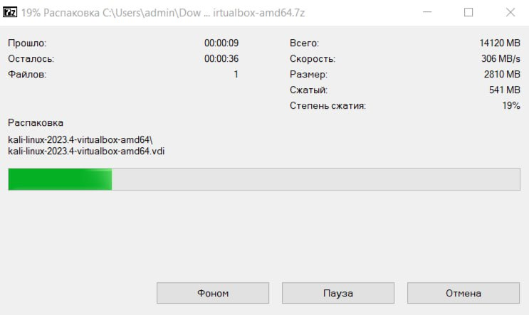
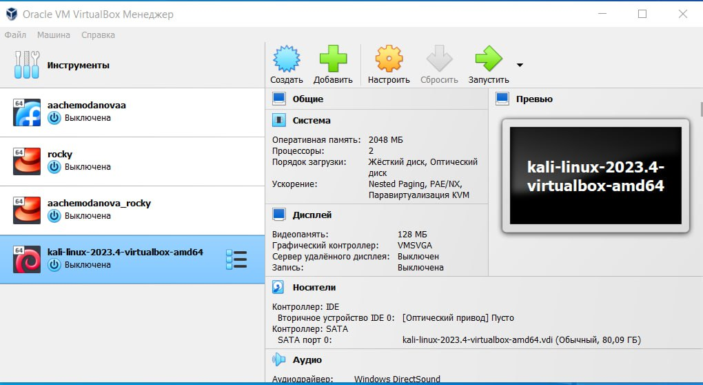
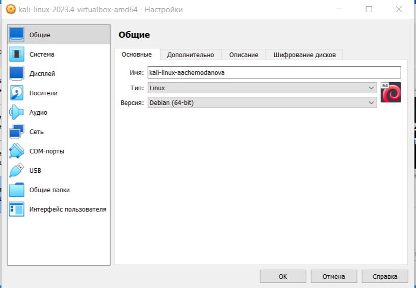
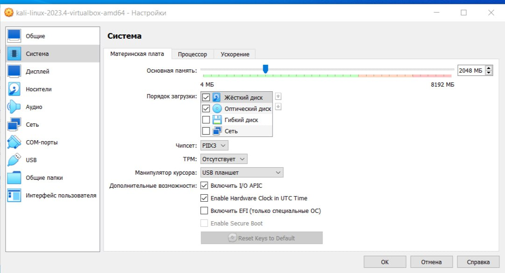
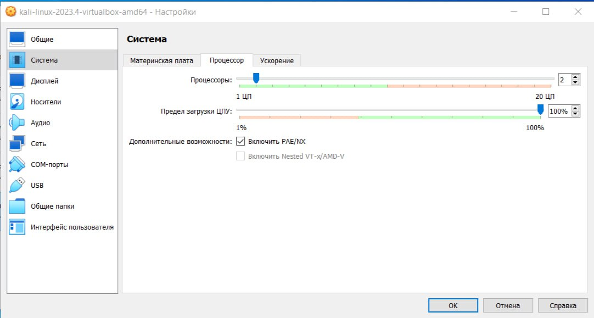
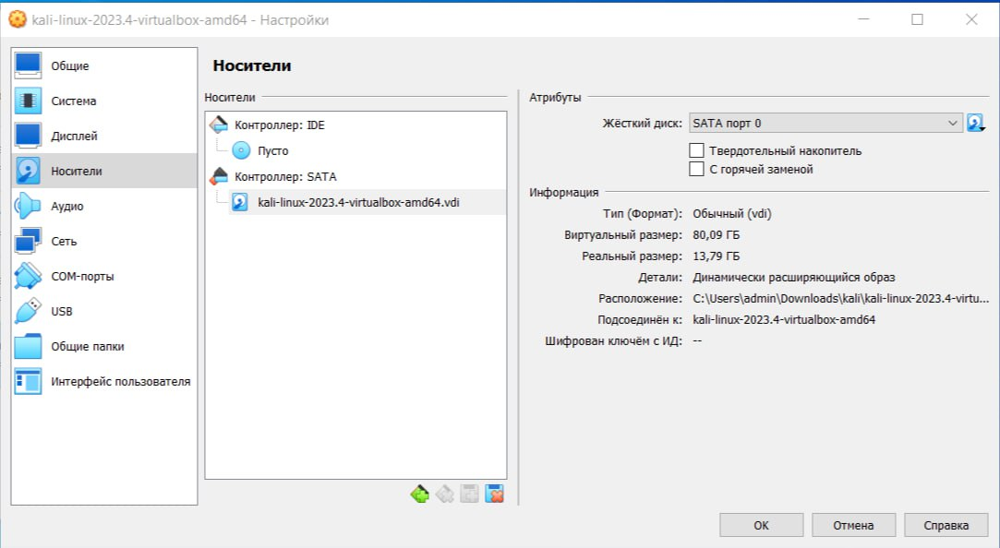
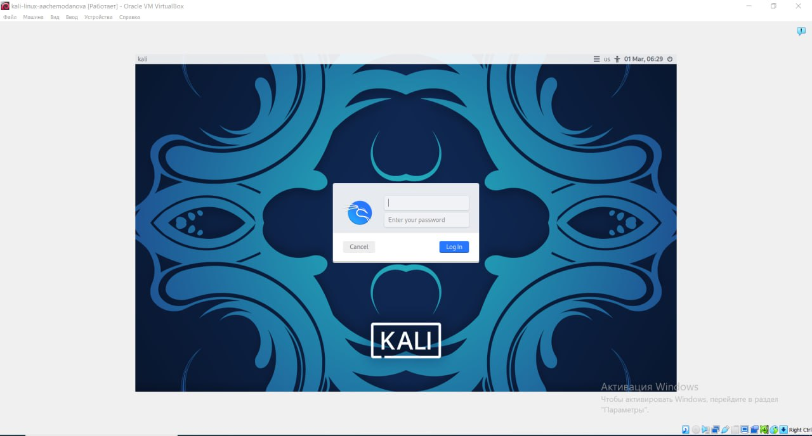
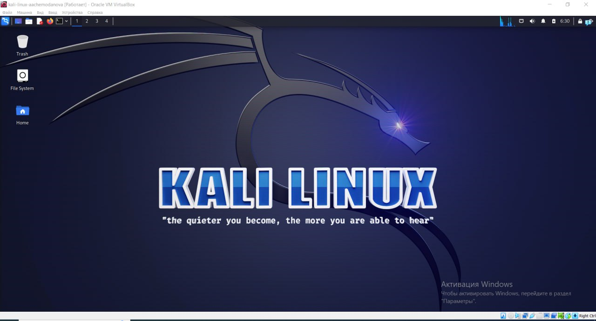

---
## Front matter
lang: ru-RU
title: "Индивидуальный проект. Первый этап"
subtitle: "Установка Kali Linux на виртуальную машину"
author:
  - Чемоданова А.А.

## Formatting pdf
toc: false
toc-title: Содержание
slide_level: 2
aspectratio: 169
section-titles: true
theme: metropolis
header-includes:
 - \metroset{progressbar=frametitle,sectionpage=progressbar,numbering=fraction}
 - '\makeatletter'
 - '\beamer@ignorenonframefalse'
 - '\makeatother'
---

## Цель работы

Установить дистрибутивa Kali Linux на виртуальную машину.

## Выполнение работы

1. С официального сайта Kali Linux качаем нужный нам дистрибутив. В моем случае я установила архив формата 7z.

{#fig:001 width=50%}

## Выполнение работы

2.  Распаковав его я получила два файла форматов vdi и vbox. 

{#fig:002 width=70%}

## Выполнение работы

3.  Затем в VirtualBox я нажала на кнопку "добавить" и выбрала там скачанный файл формата vbox. После этого у меня появилась новая виртуальная машина.  

{#fig:003 width=70%}

## Выполнение работы

4. Изменяем имя машины.  

{#fig:004 width=50%}

## Выполнение работы

5. Количество памяти, основные характеристики материнской платы.  

{#fig:005 width=70%}

## Выполнение работы

6. Количество процессоров и предел загрузки ЦПУ. 

{#fig:006 width=70%}

## Выполнение работы

7. Проверка установленного образа.

{#fig:007 width=70%}

## Выполнение работы

8. Запуск Kali Linux и ввод пароля. 

{#fig:008 width=70%}

## Выполнение работы

9. Запущенная машина с дистрибутивом Kali Linux. 

{#fig:009 width=70%}

## Выводы

В результате выполнения работы мы приобрели практические навыки установки операционной системы на виртуальную машину, поставили Kali Linux на свою виртальную машину. 

