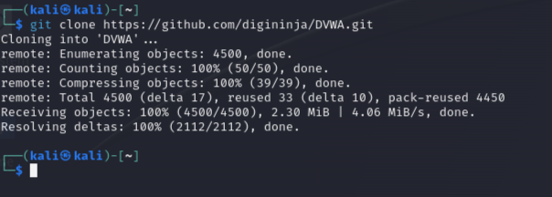
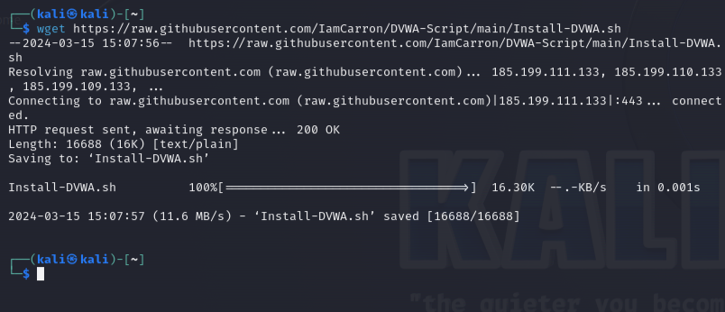
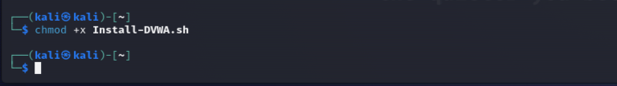
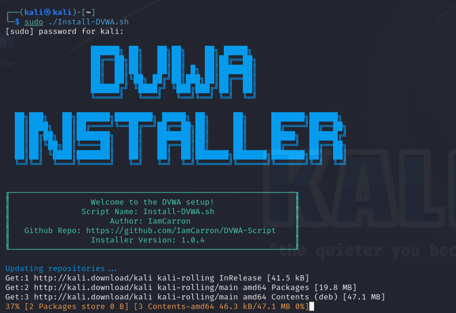
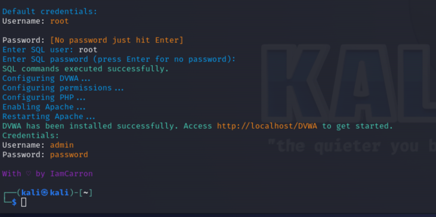
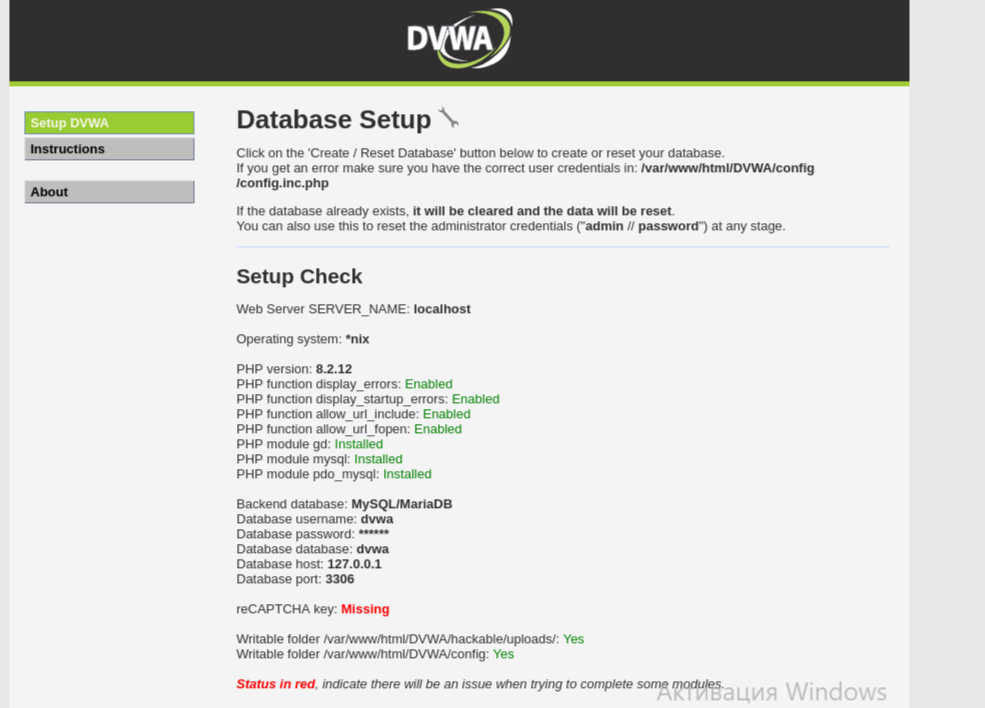
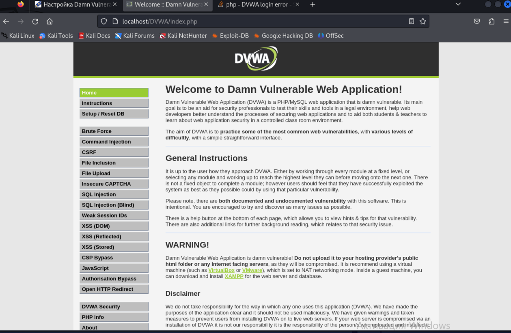

---
## Front matter
lang: ru-RU
title: "Индивидуальный проект. Второй этап"
subtitle: "Установка DVWA"
author:
  - Чемоданова А.А.

## i18n babel
babel-lang: russian
babel-otherlangs: english

## Formatting pdf
toc: false
toc-title: Содержание
slide_level: 2
aspectratio: 169
section-titles: true
theme: metropolis
header-includes:
 - \metroset{progressbar=frametitle,sectionpage=progressbar,numbering=fraction}
 - '\makeatletter'
 - '\beamer@ignorenonframefalse'
 - '\makeatother'
---

## Цель работы

Установка DVWA в гостевую систему к Kali Linux.

## Выполнение индивидуального проекта

Для начала мы клонируем репозиторий DVWA.

{#fig:001 width=70%}

## Выполнение индивидуального проекта

Запускаем скрипт. 

{#fig:002 width=70%}

## Выполнение индивидуального проекта

Изменяем права на скрипт. 

{#fig:003 width=70%}

## Выполнение индивидуального проекта

Производим установку. 

{#fig:004 width=50%}

## Выполнение индивидуального проекта

Получаем логин и пароль для DVWA.

{#fig:005 width=70%}

## Выполнение индивидуального проекта

Запускаем сайт. 

{#fig:006 width=35%}

## Выполнение индивидуального проекта

Создаем базу данных. 

{#fig:007 width=35%}

## Выводы

Мы установили DVWA в гостевую систему к Kali Linux.
